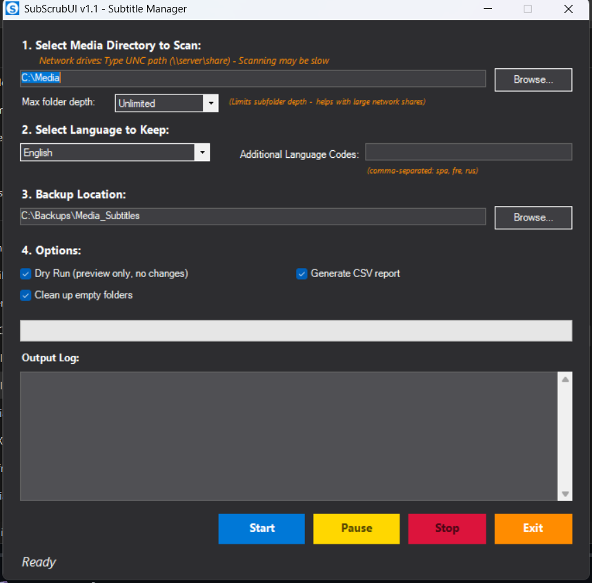

```
   _____       __   _____                __    __  ______
  / ___/__  __/ /_ / ___/____________  __/ /_  / / / /  _/
  \__ \/ / / / __ \\__ \/ ___/ ___/ / / / __ \/ / / // /  
 ___/ / /_/ / /_/ /__/ / /__/ /  / /_/ / /_/ / /_/ // /   
/____/\__,_/_.___/____/\___/_/   \__,_/_.___/\____/___/   
```

# SubScrubUI v1.1

**A graphical subtitle management tool for your media library**


---

SubScrubUI helps you organize subtitle files in your media library with an intuitive dark-themed GUI. Automatically archive non-preferred language subtitles while keeping your chosen language files in place.

Perfect for **Plex**, **Jellyfin**, **Emby**, or any media server!

> 💡 **Looking for automation?** Check out [SubScrub](https://github.com/ChopsGarbageCollection/SubScrub) - the command-line version perfect for scheduled tasks and batch processing.

---

## 🎭 SubScrubUI vs SubScrub

| Feature | SubScrubUI (This) | [SubScrub](https://github.com/ChopsGarbageCollection/SubScrub) (CLI) |
|---------|-------------------|--------|
| **Interface** | ✅ Dark theme GUI | 📝 Interactive prompts |
| **Visual Progress** | ✅ Progress bar + real-time log | ✅ Console output |
| **Pause/Resume** | ✅ Full control during operation | ❌ Run to completion |
| **CSV Reports** | ✅ Detailed 7-column reports | ✅ Text-based logs |
| **Automation** | ❌ GUI requires interaction | ✅ Perfect for scheduled tasks |
| **Best For** | Visual users, one-time cleanups | Power users, automation |

**TL;DR:** Use SubScrubUI for a GUI experience, or [SubScrub CLI](https://github.com/ChopsGarbageCollection/SubScrub) for automation.

---

## ✨ Features

✅ **Dark Theme GUI** - Modern, easy-on-the-eyes interface with visual controls  
✅ **Multi-Language Support** - Keep English, Spanish, French, German, and 20+ more languages  
✅ **Safe Archiving** - Moves unwanted subs to timestamped backups (never deletes)  
✅ **Dry Run Mode** - Preview changes before committing  
✅ **CSV Reports** - Detailed 7-column logs of all operations  
✅ **Empty Folder Cleanup** - Automatically remove empty directories  
✅ **Pause/Resume/Stop** - Full control during operations  
✅ **Real-Time Progress** - Live status updates and progress bar  
✅ **Network Path Support** - Works with UNC paths (`\\server\share`)  
✅ **Depth Limiting** - Control scan depth for large network shares  
✅ **Duplicate Detection** - Finds and archives duplicate language files  
✅ **Flexible Language Codes** - Supports 12+ built-in languages + custom codes

**Supported Formats:** `.srt`, `.vtt`, `.ass`, `.sub`, `.ssa`

---

## 🚀 Quick Start

### Option 1: Simple (Recommended)

1. Download the latest release
2. Extract the ZIP file  
3. Double-click `SubScrubUI.exe`
4. Configure your preferences in the GUI
5. Choose **Dry Run** for your first time

### Option 2: Build from Source

1. Clone this repository
2. Run `BUILD-UI.bat`
3. Launch `SubScrubUI.exe`

---

## 📥 Installation

### Download Options

**Beginner-Friendly (Recommended):**  
📦 Download `SubScrubUI.exe` from [Releases](#)  
✅ No installation required - just run the .exe

**Power Users:**  
📦 Clone the repository and build from source

### Requirements

- Windows 10/11
- PowerShell 5.1+ (included with Windows)
- Admin rights (for PS2EXE module during build only)

---

## 🌍 Supported Languages

SubScrubUI includes built-in mappings for 12+ languages:

| Code | Language | Code | Language   | Code | Language   |
| ---- | -------- | ---- | ---------- | ---- | ---------- |
| eng  | English  | spa  | Spanish    | fre  | French     |
| ger  | German   | ita  | Italian    | por  | Portuguese |
| jpn  | Japanese | chi  | Chinese    | kor  | Korean     |
| rus  | Russian  | dut  | Dutch      | pol  | Polish     |

**Don't see your language?** No problem! Enter any language code in the "Additional Language Codes" field.

---

## 📖 Usage Examples

### Scenario 1: Spanish Media Library

You have a library with Spanish content and want to keep Spanish subs:

**GUI Steps:**
1. Source: `D:\Movies`
2. Language: `Spanish`
3. Check "Dry Run" for preview
4. Click "Start"

**Result:** Shows what would be kept vs. archived  
**Keeps:** spanish, spa, es, es-mx, es-es  
**Archives:** All other languages

### Scenario 2: Bilingual Library (English + Spanish)

You want to keep BOTH English and Spanish:

**GUI Steps:**
1. Source: `\\NAS\Media\TV Shows`
2. Language: `English`
3. Additional codes: `spa, spanish, es`
4. Max depth: `10 levels`
5. Check "Generate CSV report"
6. Click "Start"

**Result:** Keeps English + Spanish, archives everything else

### Scenario 3: Anime Collection (Japanese)

**GUI Steps:**
1. Source: `D:\Anime`
2. Language: `Japanese`
3. Check "Clean up empty folders"
4. Click "Start"

**Keeps:** japanese, jpn, ja, ja-jp  
**Archives:** All other languages

---

## 🎯 How It Works

1. **Scans** your media directory for subtitle files
2. **Analyzes** filenames for language codes
3. **Detects** duplicate subtitles
4. **Keeps** subtitles matching your language preference
5. **Archives** all other subtitles to a backup folder (structure preserved)
6. **Cleans** empty folders (optional)
7. **Logs** everything in detailed CSV reports

### What Gets Kept vs Archived?

**KEPT:**
```
movie.eng.srt          ✅ (English selected)
movie.en.srt           ✅ (Matches eng)
movie.english.srt      ✅ (Matches eng)
show.s01e01.en-US.srt  ✅ (Matches eng)
```

**ARCHIVED:**
```
movie.spa.srt          📦 (Spanish - not selected)
movie.fre.srt          📦 (French - not selected)
movie.ger.srt          📦 (German - not selected)
show.s01e01.es-MX.srt  📦 (Spanish - not selected)
```

---

## 📂 Output

After running SubScrubUI, you'll find:

**In Source Directory:**
- `SubScrub_Report_YYYYMMDD_HHMMSS.csv` - Detailed operation log
- Only your preferred language subtitle files remain

**In Backup Location:**
- `Backup_YYYYMMDD_HHMMSS/` - Timestamped folder with archived files
- Original folder structure preserved
- Easy to restore if needed

---

## 📊 CSV Reports

SubScrubUI generates detailed CSV reports for audit trails:

**Location:** `[Source]\SubScrub_Report_YYYYMMDD_HHMMSS.csv`

**Columns:**
- FileName
- FilePath  
- SizeKB
- DetectedLanguage
- Action (Kept / Archived / Would Archive)
- Extension
- LastModified

**Example:**
```csv
FileName,FilePath,SizeKB,DetectedLanguage,Action
Movie.eng.srt,D:\Movies,25.3,eng,Kept
Movie.spa.srt,D:\Movies,23.1,spa,Archived
Movie.fre.srt,D:\Movies,24.8,fre,Archived
```

---

## 🛡️ Safety Features

✅ **Never Deletes** - Files are moved to timestamped backup folders  
✅ **Dry Run Mode** - Preview before committing any changes  
✅ **Original Structure** - Folder hierarchy preserved in backups  
✅ **Detailed Logs** - CSV reports track every operation  
✅ **Excluded Folders** - Skips system folders (`$RECYCLE.BIN`, `@eaDir`, etc.)  
✅ **Pause/Resume** - Full control during processing  
✅ **Minimum File Size** - Ignores tiny files (prevents false positives)

---

## ⚙️ Configuration

### GUI Controls

**Source Directory:**  
- Browse button or type path directly
- Supports UNC paths: `\\server\share`

**Language Selection:**  
- Dropdown: 12 built-in languages
- Additional codes: Comma-separated custom codes

**Max Folder Depth:**  
- Unlimited (default)
- 3 / 5 / 10 levels  
- Helps with large network shares

**Options:**  
- ☑️ Dry Run (preview only)
- ☑️ Clean up empty folders
- ☑️ Generate CSV report

---

## 🎮 Controls

**During Operation:**
- **Pause** - Temporarily halt processing
- **Resume** - Continue from paused position  
- **Stop** - Abort operation (changes made remain)

**Visual Feedback:**
- Real-time progress bar
- Live status updates
- Scrolling log output
- Color-coded buttons

---

## 🆘 Troubleshooting

### Antivirus Blocks SubScrubUI.exe

**Cause:** PowerShell-compiled .exe files sometimes trigger false positives  
**Solution:** Add exception to antivirus, or run the .ps1 script directly

### Files Not Detected as English

**Check:** Filename must contain language code (e.g., `movie.eng.srt`)  
**Solution:** Add alternative codes in "Additional Language Codes" field

### Empty Folders Won't Delete

**Note:** Normal on network drives - Windows holds file handles briefly  
**Solution:** Script includes multiple cleanup passes. Delete manually if needed.

### Want to Restore Archived Subtitles?

1. Navigate to backup folder
2. Find timestamped backup (e.g., `Backup_20241215_153217`)
3. Copy files back to original locations (check CSV report for paths)

---

## 🔧 Development

### Building from Source

**Create the .exe:**

```batch
BUILD-UI.bat
```

This will:
1. Install PS2EXE module (if needed)
2. Compile `SubScrubUI-v1.1.ps1` → `SubScrubUI.exe`
3. Embed icon (if `SubScrub.ico` present)
4. Verify compilation

**Requirements:**
- PowerShell 5.1+
- PS2EXE module (auto-installed by build script)

**Manual Compilation:**

```powershell
Install-Module ps2exe -Scope CurrentUser -Force

Invoke-ps2exe -InputFile "SubScrubUI-v1.1.ps1" `
              -OutputFile "SubScrubUI.exe" `
              -noConsole `
              -iconFile "SubScrub.ico" `
              -title "SubScrubUI v1.1"
```

---

## 📊 Version History

### v1.1 (2024-12-15)

✨ **NEW:** CSV report generation  
✨ **NEW:** Empty folder cleanup  
✅ Dark theme GUI  
✅ Pause/Resume/Stop controls  
✅ Real-time progress updates  
✅ Depth limiting  
✅ Network path support

### v1.0 (2024-12-14)

✅ Initial GUI release  
✅ Multi-language filtering  
✅ Safe backup system  
✅ Dry run mode

---

## 🤝 Contributing

Contributions are welcome! Please feel free to submit a Pull Request.

### Areas for Contribution

- Additional language mappings
- UI/UX improvements
- Performance optimizations
- Bug fixes
- Documentation improvements

---

## 💬 Support

- 🐛 **Issues:** [GitHub Issues](#)
- 💡 **Feature Requests:** [GitHub Discussions](#)
- 📖 **Documentation:** See `QUICK-START.md` and other docs in repo

---

## ⭐ Show Your Support

If SubScrubUI helped organize your media library, please consider:

- ⭐ Starring this repository
- 🍴 Forking and contributing
- 📢 Sharing with others
- 🐛 Reporting bugs or suggesting features

---

## 🔗 Related Projects

**[SubScrub](https://github.com/ChopsGarbageCollection/SubScrub)** - Command-line version  
Perfect for automation, scheduled tasks, and server environments.  
Same core logic, different interface.

---

**Made with ❤️ for media enthusiasts everywhere**

---

## 🎬 Screenshot



*Dark theme GUI with real-time progress tracking and visual controls*

<div align="center">

## ⚖️ License

This software is provided "as is" without warranty of any kind. Use at your own risk.

Always backup your data before running utilities that modify your file system.

Distributed under the MIT License.


